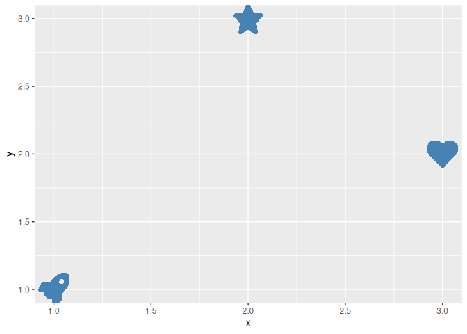
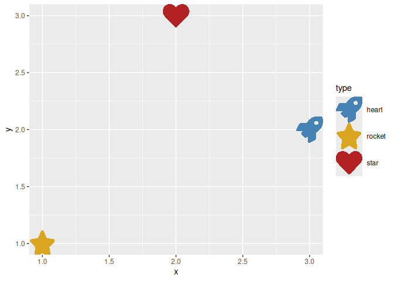
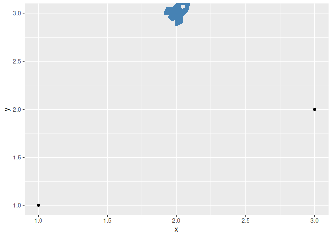
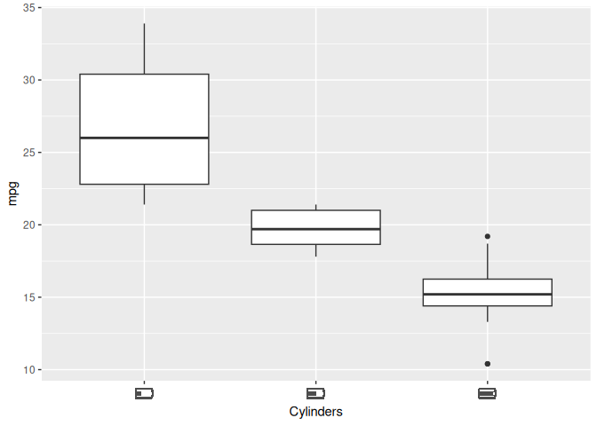

# ggicons

The ggicons package lets you visualise data with icons in
[ggplot2](https://ggplot2.tidyverse.org). It draws vector icons from the
[icons](https://pkg.mitchelloharawild.com/icons/) package directly in a
ggplot2 plot. Icons can be mapped to data and drawn like points, placed
at fixed positions as annotations, or substituted in for axis, strip and
legend labels (all styled with colour, size, alpha and angle
aesthetics).

## Installation

You can install the **released** version of ggicons from
[CRAN](https://CRAN.R-project.org/package=ggicons) with:

``` r

install.packages("ggicons")
```

You can install the **development** version from
[GitHub](https://github.com/mitchelloharawild/ggicons) with:

``` r

# install.packages("remotes")
remotes::install_github("mitchelloharawild/ggicons")
```

## Usage

``` r

library(ggplot2)
library(ggicons)
library(icons)
```

### Drawing icons with `geom_icon()`

[`geom_icon()`](https://pkg.mitchelloharawild.com/ggicons/reference/geom_icon.md)
draws an icon per row at `(x, y)`, in place of a point. Map an icon
vector from the icons package (e.g. `icons::fontawesome$solid$rocket`)
to the `icon` aesthetic, and style it with the usual `colour`, `size`,
`alpha` and `angle` aesthetics:

``` r

df <- data.frame(
  x = 1:3, y = c(1, 3, 2),
  icon = c(
    fontawesome$solid$rocket,
    fontawesome$solid$star,
    fontawesome$solid$heart
  )
)
ggplot(df, aes(x, y, icon = icon)) +
  geom_icon(size = 12, colour = "steelblue")
```



### Mapping data to icons

If the `icon` aesthetic is already mapped to icon values,
[`scale_icon_identity()`](https://pkg.mitchelloharawild.com/ggicons/reference/scale_icon_identity.md)
passes them through unchanged. To map a discrete data column (e.g. a
category) to an icon instead, use
[`scale_icon_manual()`](https://pkg.mitchelloharawild.com/ggicons/reference/scale_icon_manual.md).
There’s no automatic discrete palette for icons, so `values` is always
required:

``` r

df <- data.frame(
  x = 1:3, y = c(1, 3, 2),
  type = c("rocket", "star", "heart")
)
ggplot(df, aes(x, y, icon = type, colour = type)) +
  geom_icon(size = 12) +
  scale_icon_manual(values = c(
    fontawesome$solid$rocket,
    fontawesome$solid$star,
    fontawesome$solid$heart
  )) +
  scale_colour_manual(values = c("steelblue", "goldenrod", "firebrick"))
```



Icons drawn with
[`geom_icon()`](https://pkg.mitchelloharawild.com/ggicons/reference/geom_icon.md)
also appear as their own legend key glyph, via
[`draw_key_icon()`](https://pkg.mitchelloharawild.com/ggicons/reference/draw_key_icon.md),
so the legend shows the actual icon shape instead of a generic point.

### Annotating a plot with a fixed-position icon

[`annotation_icon()`](https://pkg.mitchelloharawild.com/ggicons/reference/annotation_icon.md)
adds one or more icons at fixed `(x, y)` positions, the `icon` analogue
of
[`annotate()`](https://ggplot2.tidyverse.org/reference/annotate.html).
Unlike
[`annotation_custom()`](https://ggplot2.tidyverse.org/reference/annotation_custom.html),
it does train the panel’s position scales, so placing an icon outside
the data’s range still expands the axes to fit it:

``` r

ggplot(data.frame(x = 1:3, y = c(1, 3, 2)), aes(x, y)) +
  geom_point() +
  annotation_icon(
    icon = fontawesome$solid$rocket,
    x = 2, y = 3, size = 14, colour = "steelblue"
  )
```



### Icons as axis, strip and legend labels

[`element_icon()`](https://pkg.mitchelloharawild.com/ggicons/reference/element_icon.md)
is a [`theme()`](https://ggplot2.tidyverse.org/reference/theme.html)
element, parallel to
[`element_text()`](https://ggplot2.tidyverse.org/reference/element.html),
for use in `axis.text`, `strip.text`, `legend.text` and similar
text-drawing theme settings. Any label matching a name in its `icons`
lookup is drawn as that icon; every other label falls back to ordinary
text:

``` r

battery <- list(
  `4` = fontawesome$solid$`battery-quarter`,
  `6` = fontawesome$solid$`battery-half`,
  `8` = fontawesome$solid$`battery-full`
)

ggplot(mtcars, aes(factor(cyl), mpg)) +
  geom_boxplot() +
  labs(x = "Cylinders") +
  theme(axis.text.x = element_icon(icons = battery, size = 16))
```


